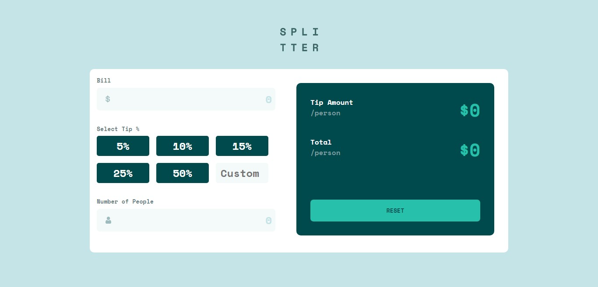

# Frontend Mentor - Tip calculator app solution

This is a solution to the [Tip calculator app challenge on Frontend Mentor](https://www.frontendmentor.io/challenges/tip-calculator-app-ugJNGbJUX). Frontend Mentor challenges help you improve your coding skills by building realistic projects.

## Table of contents

- [Overview](#overview)
  - [The challenge](#the-challenge)
  - [Screenshot](#screenshot)
  - [Links](#links)
- [My process](#my-process)
  - [Built with](#built-with)
  - [What I learned](#what-i-learned)
  - [Useful resources](#useful-resources)
- [Author](#author)

## Overview

### The challenge

Users should be able to:

- View the optimal layout for the app depending on their device's screen size
- See hover states for all inter addactive elements on the page
- Calculate the correct tip and total cost of the bill per person

### Screenshot

### Links

- Solution URL: [Add solution URL here](https://your-solution-url.com)
- Live Site URL: [Add live site URL here](https://your-live-site-url.com)

## My process

### Built with

- Semantic HTML5 markup
- CSS custom properties
- Flexbox
- CSS Grid
- Desktop-first workflow
- Javascript

### What I learned

i leart validation in input field using javascript. Leart parse.float method in javascript to convert strings to numbers. A unique thing i leart was how to set input type as text and use javascript to allow only numbers.

To see how you can add code snippets, see below:

### Useful resources

- [Code Greeper](https://www.codegreeper.com) - This helped me for the validation of input field. I really liked this pattern and will use it going forward.
- [SCrimba](https://www.scrimba.com) - This is an online IDE that i used for the javascript side of the project, it was very useful for checking results with it console section. I'd recommend it to anyone still learning this concept.

## Author

- Website - [obinneji Chibuzor](https://www.obinnejichibuzor.vercel.app)
- Frontend Mentor - [@obinneji](https://www.frontendmentor.io/profile/obinneji)
- Twitter - [@francisobinneji](https://www.twitter.com/francisobinneji)

